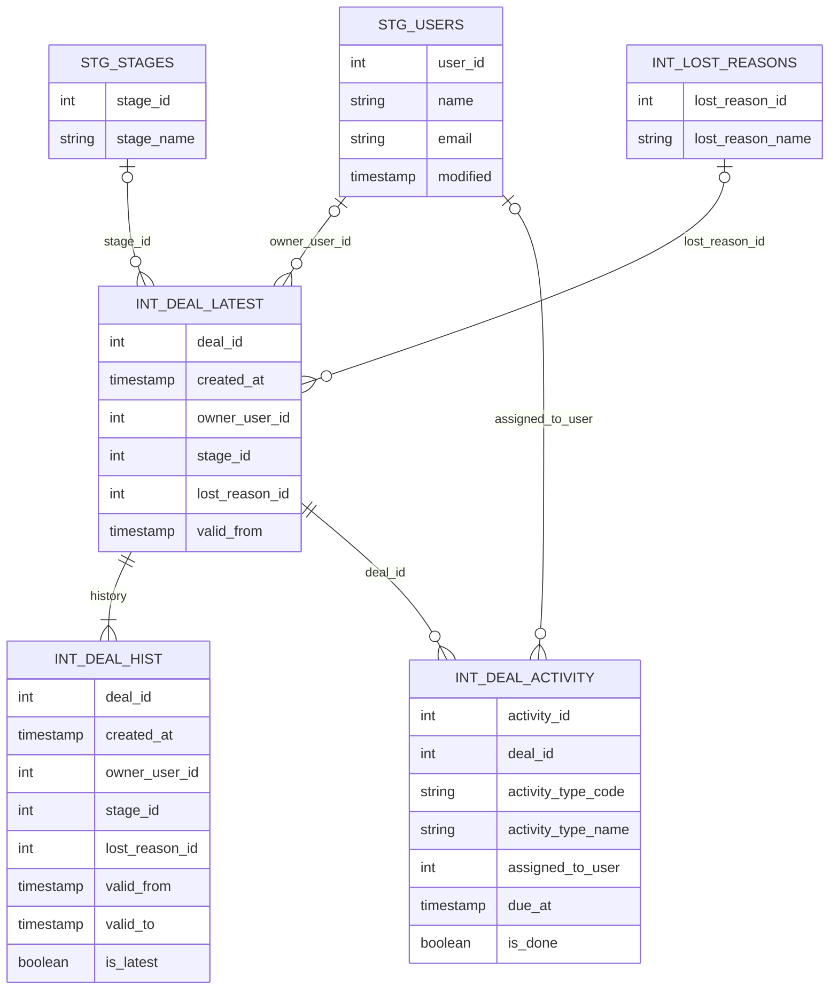

# DBT Model Design

## Main Business Entities ER Model

## Notes

- `stg_*` models are the cleaned layer over the raw sources.
- `int_deal_hist` is the deal-level history backbone and is materialized incrementally.
- `int_deal_latest` is a current-state view built from the latest history row.
- `int_lost_reasons` is a lookup view derived from field metadata.
- `int_deal_activity` is the cleaned activity fact layer.
- `rep_sales_funnel_monthly` is the monthly funnel flow summary requested by the challenge.
- The exported stage progression query is saved in [`report_queries/funnel_progression_monthly.sql`](report_queries/funnel_progression_monthly.sql).
- The report is a monthly flow view, so later stages can have higher counts than earlier stages when activities or stage changes occur in different months.

## Future Work Ideas

- Extend the KPI table with conversion rates between stages, not just deal counts.
- Add a cohort-based or cumulative funnel view using creation date as the month dimension.
- Add a second reporting table for activity performance, for example counts of completed vs open activities by month and activity type.
- Add a loss reason analysis view or table to understand why deals are lost over time.
- Add a deal-cycle table with time spent per stage and total cycle time from creation to close or loss.
- Add a sales performance table comparing deal owners, activity assignees, and their conversion / completion rates.

## Open Questions

- The raw `activity` data contains conflicting duplicate `activity_id` values with different attributes. The current staging model keeps the row with the latest `due_to` timestamp as a deterministic winner, but this should ideally be confirmed with stakeholders.
- In a production setup, should the reporting model move to a separate user-facing schema while staging and intermediate models stay in the analytics schema?
